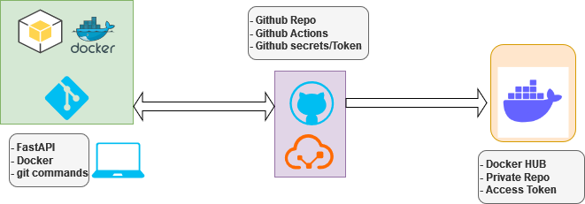

## FASTAPI - GITHUB - DOCKER HUB
This Repo aims to give a complete work around from local fastapi app to docker hub, using github actions

**Here are Steps:**
- Set up tools
- Set up github repo
- Set up docker hub
- Code API
- Build image
- Set up CI/CD pipelines
- Test All 

